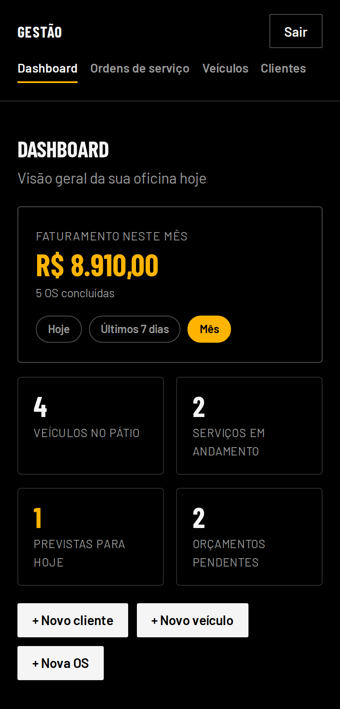
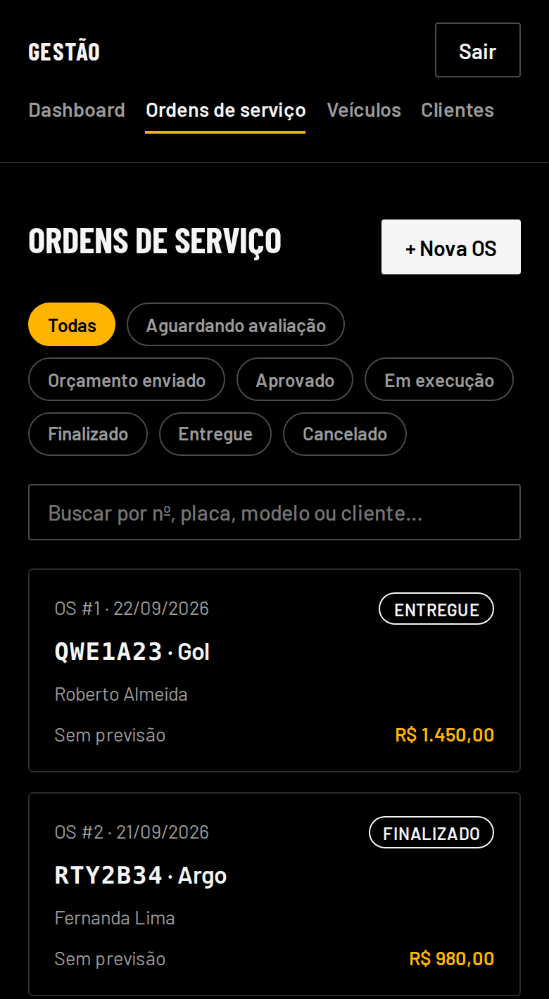

# Sistema Digital para Oficina Mecânica

Site institucional com captação de orçamento pelo WhatsApp e um sistema interno de gestão
(dashboard, ordens de serviço, clientes e veículos) para uma oficina mecânica real — a Oficina
Parada 799, no Rio de Janeiro.

Projeto pessoal, do levantamento de requisito com o cliente até o deploy em produção.

<p>
  
  
</p>

## O problema

Uma oficina pequena recebe pedido de orçamento pelo WhatsApp de forma desorganizada: mensagens
soltas, sem padrão, sem histórico do que já foi combinado com o cliente. O projeto ataca isso em
duas pontas:

1. **Site + bot do WhatsApp**: o cliente chega pelo Google/Instagram, descreve o problema em um
   fluxo guiado (sem digitar texto livre) e a oficina recebe o pedido já estruturado.
2. **Gestão interna** (`/gestao`): depois que o cliente chega, a oficina cadastra o veículo, abre
   uma ordem de serviço, acompanha o status até a entrega e enxerga faturamento e pátio num
   dashboard.

## Funcionalidades

**Site público**
- Página institucional com identidade visual própria, seção de serviços e mapa (Google Maps Embed API)
- Atendimento automatizado pelo WhatsApp Cloud API: uma máquina de estados conduz o cliente por
  perguntas objetivas (veículo, ano, serviço, foto do problema)
- Painel simples (`/admin`) para a oficina acompanhar os pedidos recebidos

**Gestão da oficina** (`/gestao`, login próprio)
- Dashboard: faturamento por período (hoje / 7 dias / mês), veículos no pátio, serviços em
  andamento, ordens previstas para o dia e orçamentos pendentes
- Ordens de serviço com itens de serviço/peça, total calculado no servidor e um fluxo de status
  (aguardando avaliação → orçamento enviado → aprovado → em execução → finalizado → entregue),
  com validação de quais transições são permitidas
- Cadastro de clientes e veículos, com histórico de ordens por veículo

## Stack

| Camada | Tecnologia |
|---|---|
| Frontend | Next.js 15 (App Router), React 19, TypeScript |
| Estilo | CSS puro (sem framework), tema escuro desenhado para o negócio |
| Backend | Route Handlers do Next.js (Node.js) |
| Banco (gestão) | PostgreSQL |
| Banco (conversa do bot) | Redis (Upstash), chave-valor |
| Autenticação | bcrypt + JWT em cookie `httpOnly` (`jose`, compatível com o runtime Edge do middleware) |
| Integração externa | WhatsApp Cloud API (Meta) |
| Testes | `node:test` nativo, sem framework externo |
| Deploy | Vercel |

## Decisões técnicas

Alguns pontos em que priorizei corretude e manutenção em vez do caminho mais rápido:

- **Webhook do WhatsApp validado por HMAC** (`X-Hub-Signature-256`) com comparação *timing-safe*
  e deduplicação de mensagem repetida — a Meta reenvia webhooks, então idempotência não é opcional.
- **Duas autenticações diferentes, de propósito**: Basic Auth simples no `/admin` (painel de leitura
  para uma pessoa), e login com bcrypt + JWT em `/gestao` (várias contas, mais dado sensível).
  O JWT usa `jose` em vez de `jsonwebtoken` porque o middleware roda no runtime Edge, que não tem o
  módulo `crypto` do Node.
- **Fluxo de status da ordem de serviço como função pura testada** (`transicaoPermitida`,
  `proximosStatus`), sem acesso a banco — a regra de negócio (o que pode virar o quê) é validada
  isoladamente, sem precisar de um banco de dados no ar para rodar o teste.
- **Faturamento calculado no fuso `America/Sao_Paulo`, não no fuso do servidor.** Sem isso, uma
  ordem fechada às 21h no Brasil seria contabilizada no dia seguinte (servidor em UTC).
- **Exclusão lógica em vez de `DELETE`**: cliente, veículo e ordem de serviço são desativados/
  cancelados, não apagados — apagar quebraria o histórico financeiro do dashboard.
- **Validação de entrada com os mesmos limites das colunas do banco** (ex.: campo de até 100
  caracteres na aplicação porque a coluna é `VARCHAR(100)`), para não deixar o Postgres rejeitar
  um dado que passou pela validação.

## Testes

```bash
npm test
```

Testes automatizados (`node:test`) cobrindo a máquina de estados do bot do WhatsApp e as regras
de negócio das ordens de serviço (transições de status válidas, cálculo de total, cálculo de
período do dashboard considerando fuso horário e ano bissexto).

## Estrutura

```
src/
├── app/
│   ├── page.tsx               site público
│   ├── admin/                 painel de leads (Basic Auth)
│   ├── gestao/                 dashboard, ordens de serviço, clientes, veículos
│   └── api/
│       ├── whatsapp/webhook/  webhook validado por HMAC
│       └── gestao/            API da gestão (auth, os, clientes, veiculos)
├── lib/
│   ├── flow.ts                 máquina de estados do bot (testada)
│   ├── os.ts                   regras de negócio das ordens de serviço (testada)
│   ├── db.ts                   conexão Postgres
│   ├── gestao-auth.ts          JWT (jose)
│   └── kv.ts                   Redis / arquivo local (conversa do bot)
migrations/                     schema do Postgres, incremental
```

## Rodar localmente

```bash
npm install
cp .env.example .env.local
npm run dev
npm test
```

O passo a passo de configuração de contas externas (WhatsApp, Google Maps, Postgres) e deploy em
produção está em [DEPLOY.md](DEPLOY.md).

## Débito técnico conhecido

Documentar o que ficou pendente é parte do trabalho, não só o que funciona:

- As rotas `/api/gestao/servicos`, do modelo anterior às ordens de serviço, continuam no código
  mas nenhuma tela as usa mais — candidatas a remoção.
- Não há upload de fotos do veículo (entrada/saída) nem exportação de relatórios do dashboard.
- `/admin` usa senha única sem limite de tentativas; para várias contas, o padrão de login do
  `/gestao` (bcrypt + JWT) é o caminho a seguir.

Mais detalhes e limitações operacionais em [DEPLOY.md](DEPLOY.md#limitações-conhecidas).

## Autor

Matheus Ansel — desenvolvedor full stack.

[LinkedIn](https://linkedin.com/in/matheusansel) · [GitHub](https://github.com/MatheusAnsel) · [Portfólio](https://matheusansel-dev.vercel.app)
